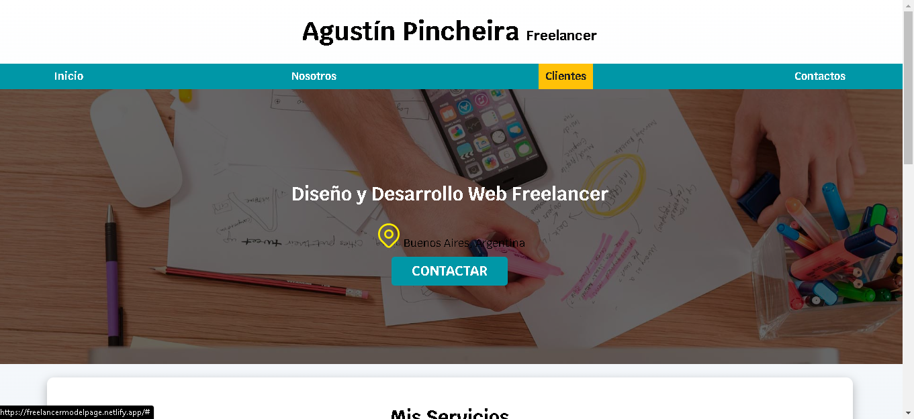
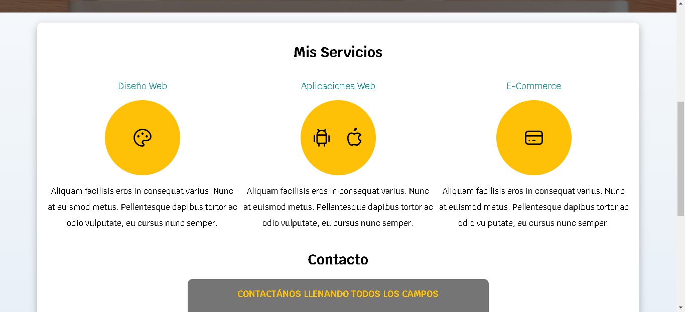

# Example_FreelancerPage

## ¿Qué es?
Es una página web sencilla desarrollada solo en HTML y CSS. No tiene funcionalidades solo es un esqueleto de lo que podría ser el home de la página de un freelancer.
Lo realice con el curso de Udemy [Desarrollo Web Completo con HTML5, CSS3, JS AJAX PHP y MySQL](https://www.udemy.com/course/desarrollo-web-completo-con-html5-css3-js-php-y-mysql/)

## Capturas

    
    
    

